

# Publications

## **2026**

---

???+ publication "URSA: The Universal Research and Scientific Agent"

    ### **URSA: The Universal Research and Scientific Agent**
    

        Grosskopf, M.; A. DeBardeleben, N.;  Wadell, A.; Bent, R.; Somasundaram, R.; Michaud, I.; Lui, A.; D. Graham, W.; Albert Wimmer, G.; Shivakumar, S.; Vendrell Gallart, J.; Nagarajan, H.; Lawrence, E. *ICLR 2026 Workshop MALGAI Submission* **2026**. https://arxiv.org/pdf/2506.22653?
    

    

      
       
      

        Large language models (LLMs) have moved far beyond their initial form as simple chatbots, now carrying out complex reasoning, planning, writing, coding, and research tasks. These skills overlap significantly with those that human scientists use day-to-day to solve complex problems that drive the cutting edge of research. Using LLMs in \quotes{agentic} AI has the potential to revolutionize modern science and remove bottlenecks to progress. In this work, we present URSA, a scientific agent ecosystem for accelerating research tasks. URSA consists of a set of modular agents and tools, including coupling to advanced physics simulation codes, that can be combined to address scientific problems of varied complexity and impact. This work highlights the architecture of URSA, as well as examples that highlight the potential of the system.
      

    

     
    

      <button onclick="window.open('https://arxiv.org/pdf/2506.22653?','_blank')">URL</button>
      <button onclick="window.open('https://openreview.net/pdf?id=6SrsLwPCLy','_blank')">PDF</button>
    

---

???+ publication "Hierarchical distillation and adaptive fine-tuning for resource-constrained large language models within agentic ai systems"

    ### **Hierarchical distillation and adaptive fine-tuning for resource-constrained large language models within agentic ai systems**
    

        Vendrell Gallart, J.; Grosskopf, M.; Bent, R. *ICLM 2026 Submission* **2026**. 
    

    

      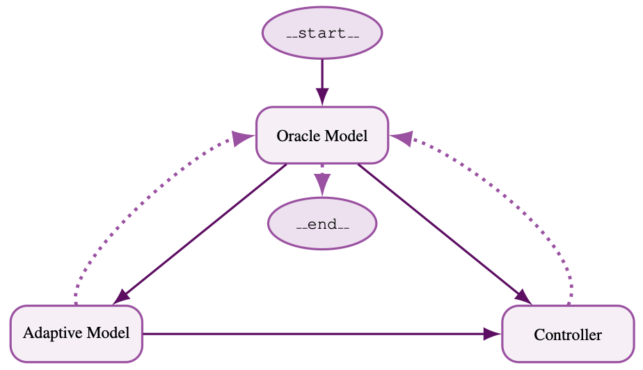
       
      

        We present a hierarchical distillation and adaptive fine-tuning framework that enables compact small models to operate reliably under the supervision of larger teacher models. Unlike static knowledge transfer, our approach integrates offline policy distillation with a inference adaptive refinement loop, explicitly regulating prompt-domain drift to maintain behavioral alignment. We evaluate this framework within The Universal Research and Scientific Agent, applying it to a Multi-Fidelity Bayesian Optimization task governed by strict memory and latency constraints. Extensive ablation studies across four teacher–student pairs (GPT-5 and GPT-5-nano supervising Llama-3.1-8B and Mistral-7B) demonstrate that hierarchical adaptation significantly improves reliability and format consistency in resource-constrained environments. These results establish a scalable pathway for deploying efficient, self-correcting agentic architectures in edge situations.
      

    

     

---

???+ publication "Chain-based adaptive reconfiguration over lattices for hallucination reduction"

    ### **Chain-based adaptive reconfiguration over lattices for hallucination reduction**
    

        Vendrell Gallart, J.; Kia, S.; Grosskopf, M.; Bent, R. *JMLR Submission* **2026**. 
    

    

      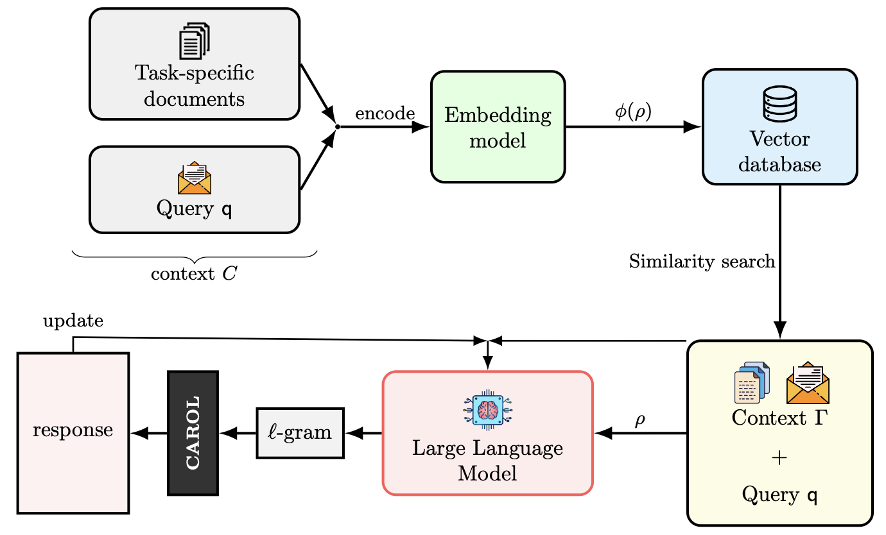
       
      

        We present Chain-based Adaptive Reconfiguration Over Lattices Algorithm (CAROL), a probabilistic framework for test-time refinement of Large Language Models for Hallucination Reduction. Instead of relying on token-level uncertainty, CAROL introduces a semantic measure of uncertainty based on the informational consistency between a generated response and its contextual knowledge. This measure is formulated as a string-submodular objective defined over the lattice of possible textual sequences. This novel formulation allows us to implement a Markov Chain sampling process to maximize the response coherence while adaptively exploring the solution space, formulated as a lattice, preserving theoretical guarantees on convergence and sub-optimality. This stochastic reconfiguration enables the model to iteratively refine responses toward semantically consistent and reliable outputs. The resulting framework provides a unified probabilistic interpretation of semantic consistency and efficient test-time adaptation. Empirical results in question answering and multi-agent reasoning tasks demonstrate that CAROL significantly reduces hallucinations and improves task reliability compared to entropy or likelihood-based baselines.
      

    

     

---

???+ publication "Optimality gap from the lense of submodular optimization theory for a network radial reconfiguration via FORWARD"

    ### **Optimality gap from the lense of submodular optimization theory for a network radial reconfiguration via FORWARD**
    

        Vendrell, J.; Kuhnle, A.; Kia, S. *IEEE 65th Conference on Decision and Control (CDC) Submission* **2026**. 
    

    

      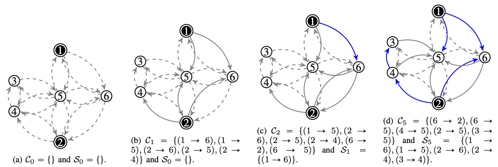
       
      

        Optimal radial reconfiguration in multi-source distribution networks is a fundamental problem in infrastructure management, characterized by a challenging interplay between discrete graph-theoretic constraints and continuous flow optimization. While the problem is known to be NP-hard, practitioners often rely on feasibility-oriented greedy heuristics like \texttt{FORWARD}. However, these algorithms have traditionally lacked formal performance guarantees, leaving a critical "optimality gap" unaddressed. This paper provides the first formal characterization of this gap through the lens of submodular optimization theory. We establish that the quadratic distribution cost function exhibits supermodular properties over a polyforest greedoid capturing the unique requirements of multi-source radiality. Consequently, we prove that the sequential construction process in FORWARD achieves a constant-factor approximation bound, specifically shown to be 2(1-1/m) under a probabilistic observability framework. This bound is further refined by the network's structural parameters, explaining the algorithm's near-optimal performance on small-world distribution grids. Our results bridge the gap between practical network engineering and theoretical optimization, providing a rigorous template for analyzing constrained greedy algorithms in large-scale network design.
      

    

     

## **2025**

---

???+ publication "Monte carlo sampling and qaoa over probabilistic submodular models"

    ### **Monte carlo sampling and qaoa over probabilistic submodular models**
    

        Vendrell, J.; Kuhnle, A.; Kia, S. *Quantum Algorithms in Pre-Fault Tolerant Hardware Basq-IBM conference Poster Acceptance* **2025**.
    

    

      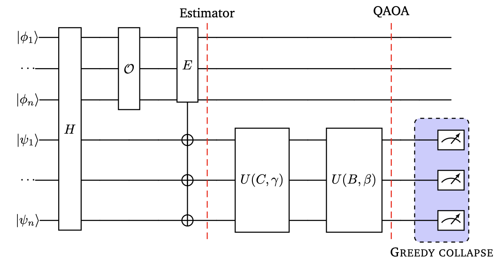
       
      

        In this poster I present a novel approach to solve submodular maximization problems via QAOA by making usage of probabilstic submodular models. By moving to the probabilistic space, the submodular probabilities are computed as quantum probabilities and evolved using classical QAOA algorithm. Then, a greedy collapse procedure finds the solution mantaining theoretical guarantees.
      

    

     

---

???+ publication "ResQue Greedy: Rewiring Sequential Greedy for Improved Submodular Maximization"

    ### **ResQue Greedy: Rewiring Sequential Greedy for Improved Submodular Maximization**
    

        Vendrell, J.; Kuhnle, A.; Kia, S. *IEEE 64th Conference on Decision and Control (CDC)* **2025**. https://doi.org/10.1109/CDC57313.2025.11312997
    

    

      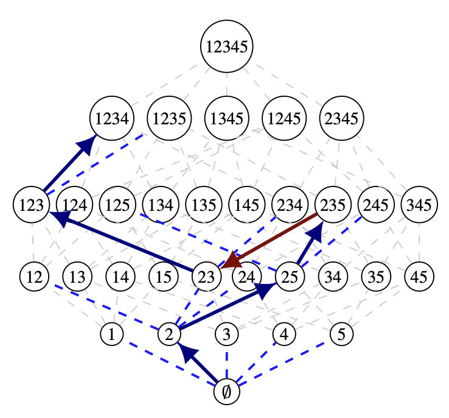
       
      

        This paper introduces Rewired Sequential Greedy (ResQue Greedy), an enhanced approach for submodular
        maximization under cardinality constraints. By integrating a novel set curvature metric within a lattice-based
        framework, ResQue Greedy identifies and corrects suboptimal decisions made by the standard sequential greedy
        algorithm. Specifically, a curvature-aware rewiring strategy is employed to dynamically redirect the solution
        path, leading to improved approximation performance over the conventional sequential greedy algorithm without
        significantly increasing computational complexity. Numerical experiments demonstrate that ResQue Greedy
        achieves tighter near-optimality bounds compared to the traditional sequential greedy method.
      

    

     
    

      <button onclick="window.open('https://doi.org/10.1109/CDC57313.2025.11312997','_blank')">URL</button>
      <button onclick="window.open('https://arxiv.org/pdf/2505.13670','_blank')">PDF</button>
    

---

???+ publication "Data-driven approaches for pipe life prognosis in water distribution networks: the Barcelona water distribution network case study"

    ### **Data-driven approaches for pipe life prognosis in water distribution networks: the Barcelona water distribution network case study**
    

        Sun, C.; Henry, D.; Vendrell, J.; Puig, V.; Bonet E. *Journal of Hydroinformatics* **2025**. https://doi.org/10.2166/hydro.2025.003
    

    

      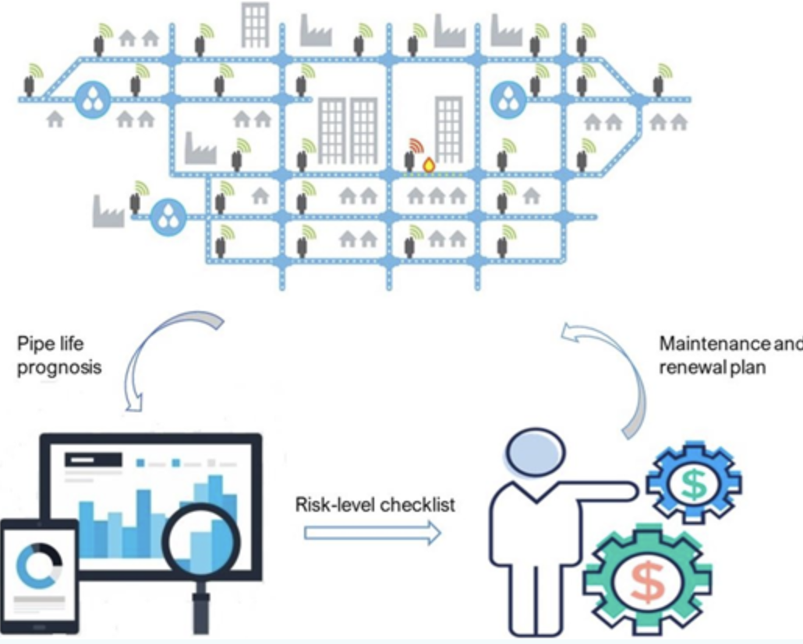
       
      

        A water distribution network is a critical infrastructure in a city whose proper function affects significantly human life. However, aging pipe assets require periodic investment plans to reduce the risk of having leaks. In order to maximize the value of the existing water infrastructure and optimize asset investment, assessing and predicting pipe life in water distribution systems has become very important. Up to now, the study for determining relevant variables and pipe failure occurrence has drawn most of the attention, which has scientific value but cannot assist real operations in the water industry. To add practical values to pipe life assessment and prognosis methods, this paper contributes (1) first, several comparable data-driven approaches are proposed to quantify pipe deterioration and the influencing variables, such as pipe diameters, materials and age; (2) then, a prediction method, for the remaining useful life of pipe assets based on the algorithms described previously, is introduced; (3) finally, an easy reading risk-level checklist is presented for all pipe assets to assist the water industry with daily operation, maintenance of assets and renewal of their water networks. All these approaches will be implemented into a real-life case study, the Barcelona WDN.
      

    

     
    

      <button onclick="window.open('https://doi.org/10.2166/hydro.2025.003','_blank')">URL</button>
      <button onclick="window.open('https://iwaponline.com/jh/article/27/6/1003/108515/Data-driven-approaches-for-pipe-life-prognosis-in','_blank')">PDF</button>
    

---

???+ publication "FORWARD: Feasibility Oriented Random-Walk Inspired Algorithm for Radial Reconfiguration in Distribution Networks"

    ### **FORWARD: Feasibility Oriented Random-Walk Inspired Algorithm for Radial Reconfiguration in Distribution Networks**
    

        Vendrell, J.; Bent, R.; Kia, S. *American Control Conference (ACC)* **2025**. https://doi.org/10.23919/ACC63710.2025.11107625
    

    

      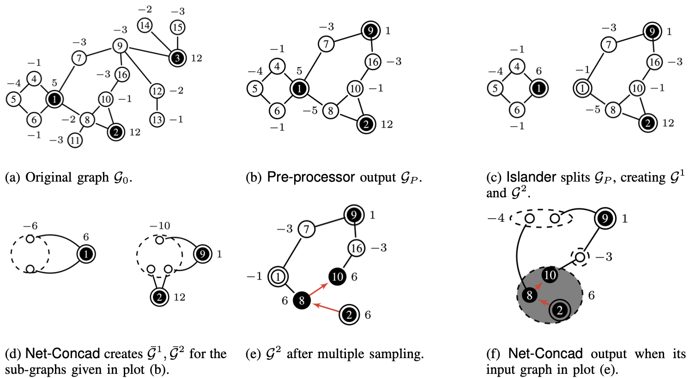
       
      

        We consider an optimal flow distribution problem in which the goal is to find a radial configuration that minimizes resistance-induced quadratic distribution costs while ensuring delivery of inputs from multiple sources to all sinks to meet their demands. This problem has critical applications in various distribution systems, such as electricity, where efficient energy flow is crucial for both economic and environmental reasons. Due to its complexity, finding an optimal solution is computationally challenging and NP-hard. In this paper, we propose a novel algorithm called FORWARD, which leverages graph theory to efficiently identify feasible configurations in polynomial time. By drawing parallels with random walk processes, our method simplifies the search space, significantly reducing computational effort while maintaining performance. The FORWARD algorithm employs a combination of network preprocessing, intelligent partitioning, and strategic sampling to construct radial configurations that meet flow requirements, finding always a feasible solution. Numerical experiments demonstrate its effectiveness, highlighting its potential for real-world applications in optimizing distribution networks.
      

    

     
    

      <button onclick="window.open('https://doi.org/10.23919/ACC63710.2025.11107625','_blank')">URL</button>
      <button onclick="window.open('https://ieeexplore.ieee.org/stamp/stamp.jsp?tp=&arnumber=11107625','_blank')">PDF</button>
    

---

???+ publication "FORWARD: A Feasible Radial Reconfiguration Algorithm for Multi-Source Distribution Networks"

    ### **FORWARD: A Feasible Radial Reconfiguration Algorithm for Multi-Source Distribution Networks**
    

        Vendrell, J.; Bent, R.; Kia, S. *Journal in Power Systems Microgrids* **2025**. 
        https://doi.org/10.48550/arXiv.2510.08785
    

    

      
       
      

        This paper considers an optimal radial reconfiguration problem in multi-source distribution networks, where the goal is to find a radial configuration that minimizes quadratic distribution costs while ensuring all sink demands are met. This problem arises in critical infrastructure systems such as power distribution, water networks, and gas distribution, where radial configurations are essential for operational safety and efficiency. Optimal solution for this problem is known to be NP-hard. In this paper, we prove further that constructing a feasible radial distribution configuration is weakly NP-complete, making exact solution methods computationally intractable for large-scale networks. We propose FORWARD (Feasibility Oriented Random-Walk Inspired Algorithm for Radial Reconfiguration in Distribution Networks), a polynomial-time algorithm that leverages graph-theoretic
        decomposition and random walk principles to construct feasible radial configurations. Our approach introduces novel techniques including strategic graph partitioning at articulation points, dual graph condensation to address greedy shortsightedness, and capacity-aware edge swapping for infeasibility resolution. We provide rigorous theoretical analysis proving feasibility guarantees and establish a compositional framework enabling parallel processing while preserving optimality properties. Comprehensive numerical evaluation on networks ranging from IEEE standard test systems to 400-node small-world networks demonstrates that FORWARD consistently outperforms commercial MINLP solvers, achieving optimal or near-optimal solutions in seconds where traditional methods require hours or fail entirely. The algorithm’s polynomial-time complexity and scalability make it particularly suitable for real-time distribution network management and as an effective initialization strategy for iterative optimization solvers.
      

    

     
    

      <button onclick="window.open('https://doi.org/10.48550/arXiv.2510.08785','_blank')">URL</button>
      <button onclick="window.open('https://arxiv.org/pdf/2510.08785','_blank')">PDF</button>
    

---

???+ publication "Microgrids optimal radial reconfiguration via FORWARD algorithm"

    ### **Microgrids optimal radial reconfiguration via FORWARD algorithm**
    

        Vendrell, J.; Bent, R.; Kia, S. *American Control Conference (ACC)* **2025**. https://doi.org/10.48550/arXiv.2511.03059
    

    

      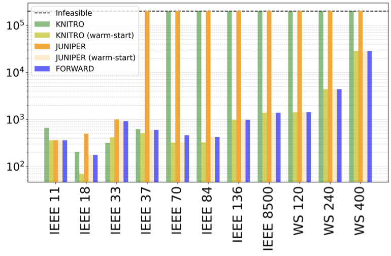
       
      

        Microgrids offer a promising paradigm for integrating distributed energy resources, bolstering energy resilience, and reducing the impact of blackouts. However, their inherent decentralization and dynamic operation present substantial energy management complexities. These complexities, including balancing supply and demand, ensuring system stability, and minimizing operational costs, often necessitate solving computationally intractable NP-hard Mixed-Integer Non-Linear Programming (MINLP) problems. Traditional MINLP solvers struggle with the scalability and feasibility guarantees required for these challenges. To address this, this paper tackles the problem of resource allocation and radial configuration design for microgrid power distribution and proposes and abstracted problem which is solved by introducing a permutation-based iterative search method over the recently introduced FORWARD method to efficiently identify feasible, near-optimal radial network structures while inherently respecting physical constraints. Furthermore, this paper investigates the integration of the proposed method as a warm-start strategy for benchmark MINLP solvers offering a scalable solution for comprehensive microgrid design.
      

    

     
    

      <button onclick="window.open('https://doi.org/10.48550/arXiv.2511.03059','_blank')">URL</button>
      <button onclick="window.open('https://arxiv.org/pdf/2511.03059','_blank')">PDF</button>
    

## **2024**

---

???+ publication "Optimality gap of decentralized submodular maximization under probabilistic communication"

    ### **Optimality gap of decentralized submodular maximization under probabilistic communication**
    

        Vendrell, J.; Kia, S. *IEEE 63rd Conference on Decision and Control (CDC)* **2024**. https://doi.org/10.1109/CDC56724.2024.10886660
    

    

      
       
      

        This paper considers the problem of decentralized
        submodular maximization subject to partition matroid con-
        straint using a sequential greedy algorithm with probabilistic
        inter-agent message-passing. We propose a communication-
        aware framework where the probability of successful commu-
        nication between connected devices is considered. Our anal-
        ysis introduces the notion of the probabilistic optimality gap,
        highlighting its potential influence on determining the message-
        passing sequence based on the agent’s broadcast reliability and
        strategic decisions regarding agents that can broadcast their
        messages multiple times in a resource-limited environment.
        This work not only contributes theoretical insights but also has
        practical implications for designing and analyzing decentralized
        systems in uncertain communication environments. A numerical
        example demonstrates the impact of our results.
      

    

     
    

      <button onclick="window.open('https://doi.org/10.1109/CDC56724.2024.10886660','_blank')">URL</button>
      <button onclick="window.open('https://ieeexplore.ieee.org/stamp/stamp.jsp?tp=&arnumber=10886660','_blank')">PDF</button>
    

## **2022**

---

???+ publication "Quantum-Inspired Evolutionary Algorithm for Optimal Service-Matching Task Assignment"

    ### **Quantum-Inspired Evolutionary Algorithm for Optimal Service-Matching Task Assignment**
    

        Vendrell, J.; Kia, S. *Information* **2022**, *13*, 438. https://doi.org/10.3390/info13090438
    

    

      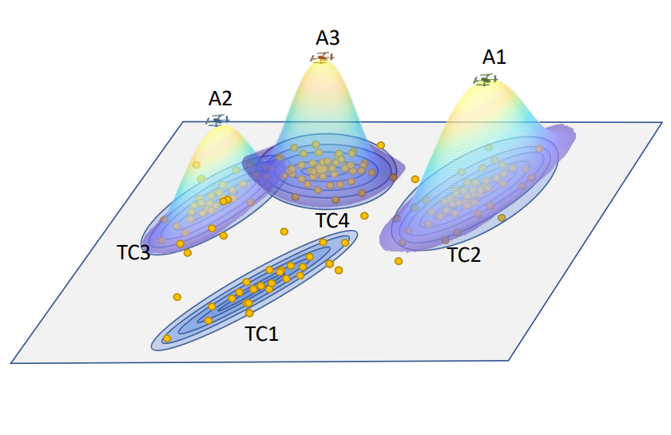
       
      

        This paper proposes a quantum-inspired evolutionary algorithm (QiEA) to solve an optimal service-matching task-assignment problem. Our proposed algorithm comes with the advantage of
        generating always feasible population individuals and, thus, eliminating the necessity for a repair
        step.
      

    

     
    

      <button onclick="window.open('https://doi.org/10.3390/info13090438','_blank')">URL</button>
      <button onclick="window.open('https://www.mdpi.com/2078-2489/13/9/438/pdf','_blank')">PDF</button>
    

## **2020-2021**

---

??? publication "Pipe life prognosis in water distribution networks using reliable data-based approaches"

    ### **Pipe life prognosis in water distribution networks using reliable data-based approaches**
    

      D. Henry, C. Sun, J. Vendrell, V. Puig and E. Bonet, **2021** *5th International Conference on Control and Fault-Tolerant Systems (SysTol)*, Saint-Raphael, France, 2021, pp. 187-192, doi: 10.1109/SysTol52990.2021.9595277.
    

    

      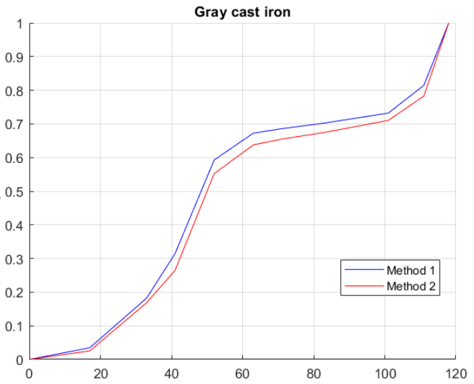
       
      

        In order to provide a pipe life assessment and prognosis approach
        with practical significance, this paper presents: 1) a comparable
        approach to quantify impact of different factors (mainly age,
        material and diameter) on the occurrence of pipe failures
        using statistical reliability model based on cumulative Weibull
        distribution, survival model based on neural networks and evolutionary polynomial regression model for pipe deterioration;
        2) a prognosis method for the remaining useful life of pipes
        using previous algorithms; 3) a maintenance and renewal plan
        of the network to assist daily operation of water operators by
        means of a checklist including risk levels (low, medium, high)
        under different factor ranges.
      

    

     
    

      <button onclick="window.open('https://scholar.google.com/scholar?oi=bibs&cluster=16808003075681759168&btnI=1&hl=en','_blank')">URL</button>
      <button onclick="window.open('https://digital.csic.es/bitstream/10261/263421/1/2560-Pipe-Life-Prognosis-in-Water-Distribution-Networks-using-Reliable-Data-based-Approaches.pdf','_blank')">PDF</button>
    

---

??? publication "Fuzzy clustering application on failure rate prediction in water distribution networks"

    ### **Fuzzy clustering application on failure rate prediction in water distribution networks**
    

      D. Henry, C. Sun, J. Vendrell, V. Puig and E. Bonet, **2021** *5th International Conference on Control and Fault-Tolerant Systems (SysTol)*, Saint-Raphael, France, 2021, pp. 187-192, doi: 10.1109/SysTol52990.2021.9595277.
    

    

      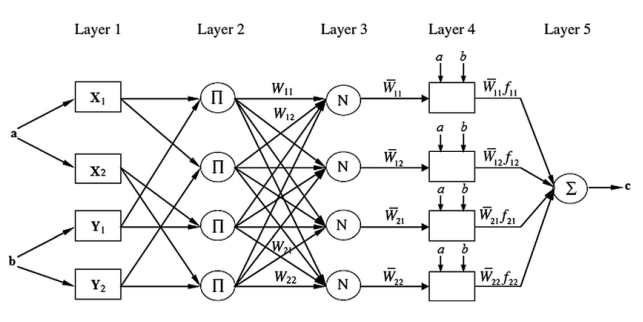
       
      

        In this report a new approach of failure rate prediction is presented based on Fuzzy Clustering technic for a more deterministic and accurate implementation of neuro-fuzzy systems. This technique is compared with two benchmark methods: Artificial Neural Networks (ANN) and Adaptative Neuro-Fuzzy Inference Systems (ANFIS).
      

    

     
    

      <button onclick="window.open('https://scholar.google.com/scholar?oi=bibs&cluster=12595531884511632409&btnI=1&hl=en','_blank')">URL</button>
      <button onclick="window.open('https://upcommons.upc.edu/bitstream/handle/2117/330935/2346-Fuzzy-clustering-application-on-failure-rate-prediction-in-Water-Distribution-Networks.pdf','_blank')">PDF</button>
    

## **2019-2020**

---

??? publication "Generative Adversarial Neural Networks for High-Frequency Stocks Prediction"

    ### **Generative Adversarial Neural Networks for High-Frequency Stocks Prediction**
    

      J. Vendrell and C. Angulo-Bahon, **2019** *Bachelor's Thesis*, Intelligent Data Science and Artificial Intelligence Research Center, Barcelona, 2019.
    

    

      
       
      

        In this work, we design a Generative Adversarial Neural Network to
        predict high-frequency stocks from the market. The model integrates
        a 1D Convolutional Neural Network as a generator and a Long-Short Term Memory
        model as discriminator which tries to predict the behavior of an stock in
        SP500 in the next microseconds. The work provides a detailed analysis of
        the precision of the model in function of data latency also studying
        distinct loss functions.
      

    

     
    

      <button onclick="window.open('https://upcommons.upc.edu/entities/publication/c7a069b7-67d8-4eb1-a546-9d20fa4a9e3d','_blank')">URL</button>
      <button onclick="window.open('https://upcommons.upc.edu/server/api/core/bitstreams/12f8bd7c-5352-40a4-880f-42033a6397e6/content','_blank')">PDF</button>
    
